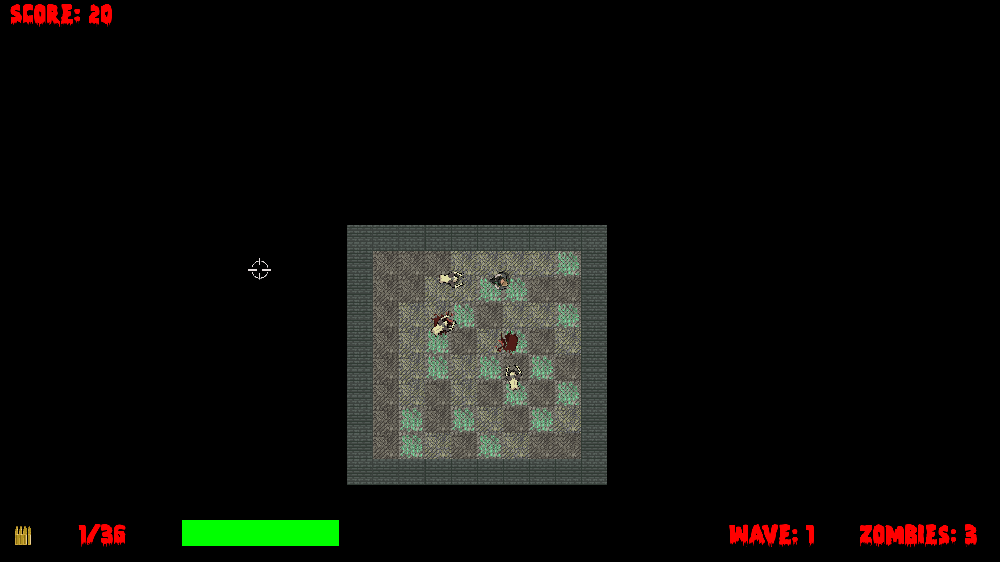

# Zombie-Arena-CppDEV

This game is made using OpenGL/SFML (Simple and Fast Multimedia Library), OOP (Object-Oriented Programming), SFML views, vertex arrays, singleton design pattern, views layering, File I/O

to kill all the zombies(crawlers, chasers, and bloaters) in a wave/level with a limited amount of ammo and health, which can be further increased by using ammo and health pickups or boosted by using one of the six boosts at the starting of each wave/level.

This is an individual project. Not an original idea (learned from c++ game programming 1 course on Linkedin learning).

